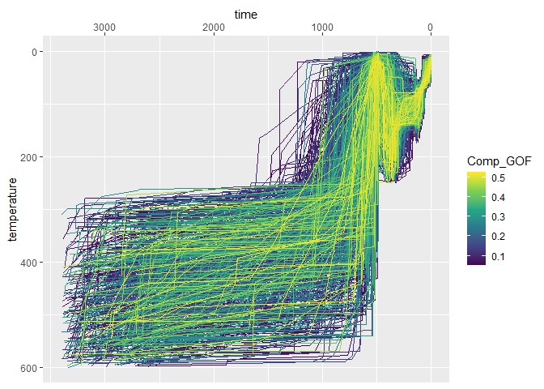
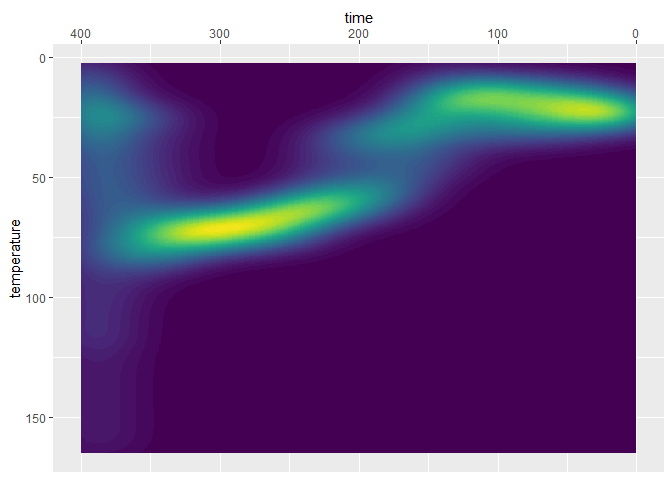
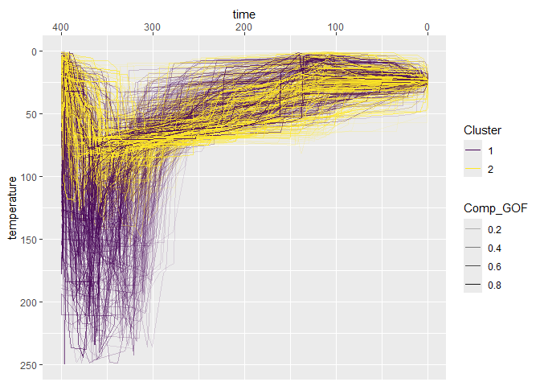

<!-- README.md is generated from README.Rmd. Please edit that file -->

# thermochron

<!-- badges: start -->

[](https://github.com/tobiste/thermochron/actions/workflows/R-CMD-check.yaml)
[](https://app.codecov.io/gh/tobiste/thermochron?branch=main)
<!-- badges: end -->

The goal of thermochron is to provide tools to further analyze thermal
history models in thermochronology, including estimating cooling path
densities, and path families.

## Installation

You can install the development version of thermochron from
[GitHub](https://github.com/) with:

``` r
# install.packages("devtools")
devtools::install_github("tobiste/thermochron")
```

## Example

The following minimal example shows how to import data, visualize the
paths and the path density as well as how to filter, and cluster the tT
paths into 3 path families.

``` r
library(thermochron)
library(dplyr)
#> Warning: package 'dplyr' was built under R version 4.3.3
#> 
#> Attaching package: 'dplyr'
#> The following objects are masked from 'package:stats':
#> 
#>     filter, lag
#> The following objects are masked from 'package:base':
#> 
#>     intersect, setdiff, setequal, union
library(ggplot2)
#> Warning: package 'ggplot2' was built under R version 4.3.3

# load example dataset of a HeFTy model output
path2myfile <- system.file("112-9-30-zr-inv.txt", package = "thermochron")
tT_paths <- read_hefty(path2myfile)
#> Warning: The `x` argument of `as_tibble.matrix()` must have unique column names if
#> `.name_repair` is omitted as of tibble 2.0.0.
#> ℹ Using compatibility `.name_repair`.
#> ℹ The deprecated feature was likely used in the thermochron package.
#>   Please report the issue to the authors.
#> This warning is displayed once every 8 hours.
#> Call `lifecycle::last_lifecycle_warnings()` to see where this warning was
#> generated.
```

The HeFTy model contains the modeled paths, the initial model
constraints, the weighted mean path, and some summary statistics on the
mineral grains. {thermochron} imports the model as a `list` that
contains the aforementioned features as list entries.

Thus, to visualize the paths with need to extract the `path` object from
the imported model `tT_paths`:

``` r
tT_paths$paths |> 
  ggplot(aes(time, temperature, color = Comp_GOF, group = segment)) +
  geom_path() +
  scale_color_viridis_c() +
  scale_x_reverse(position = "top") +
  scale_y_reverse()
```



The path density can be visualized using `plot_path_density_filled()`:

``` r
plot_path_density_filled(tT_paths, show.legend = FALSE) +
  scale_x_reverse(position = "top") +
  scale_y_reverse()
```



To cluster a subset of the data, the following steps are required:

``` r
# extract the paths and filter to time range of interest:
my_paths <- tT_paths$paths |> 
  dplyr::filter(time <= 500, temperature <= 200)

# cluster the paths
my_paths_cluster <- cluster_paths(my_paths, cluster = 3)

# Join with path dataset
my_paths_clustered <- dplyr::left_join(
  my_paths,
  my_paths_cluster,
  dplyr::join_by(segment)
)
```

Finally, the visualization of the clustered tT paths:

``` r
my_paths_clustered |>
  ggplot(
    aes(
      x = time, 
      y = temperature,
      color = cluster,
      alpha = Comp_GOF,
      group = segment
    )
  ) +
  geom_path() +
  scale_x_reverse(position = "top") +
  scale_y_reverse()
```


