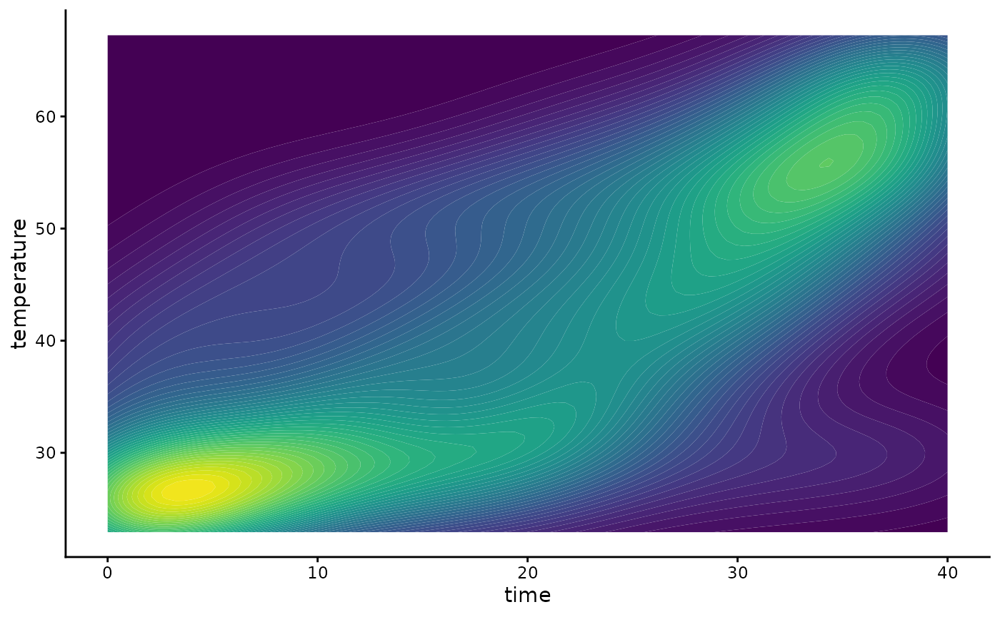
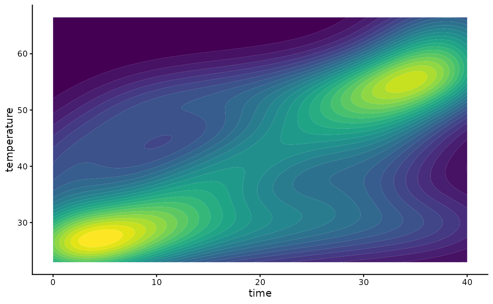
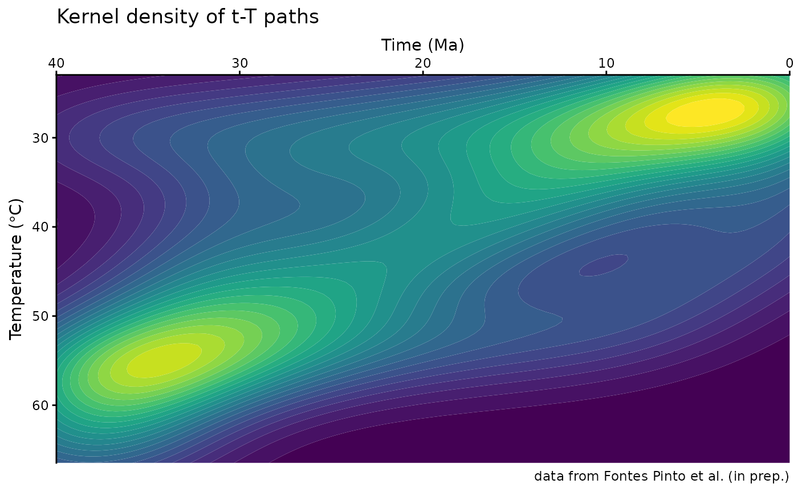

# Path density plots

This document provides step-by-step instructions for producing density
plots derived from HeFTy inverse thermal history models as seen in
Padgett et al. (2025) and Johns-Buss et al. (2025).

### Load Input Data

Open R and install and load the necessary packages. You can install the
packages by running the following code:

``` r
install.packages("ggplot2")
remotes::install_github("tobiste/thermoclustr")
```

Next, install the {thermoclustr} package by running the following code:

``` r
library(ggplot2)
library(thermoclustr)
```

Define the path to your Hefty output (.txt file). For example:

``` r
path2myfile <- "inst/112-73_30_H1_50-inv.txt"
```

> Be aware that R uses forward-slashes (/) to separate folders.

Next, you import the .txt file into R by using the function
[`read_hefty()`](https://tobiste.github.io/thermoclustr/reference/read_hefty.md):

## Part II

### Plot the path density

To plot the density of the paths, you simply use the function
[`plot_path_density()`](https://tobiste.github.io/thermoclustr/reference/plt_density.md):

``` r
# set `theme_classic()` as the default ggplot theme
theme_set(theme_classic())

plot1 <- plot_path_density_filled(tT_paths, show.legend = FALSE)
print(plot1)
```



This uses the package’s default values for smoothing and binning and
creates a `ggplot` type graphic.

You can customize the smoothing and density binning by changing the
parameters - `bins` - the number of filled contours.

- `GOF_rank` - Selects only the n highest GOF ranked paths.

- `densify` - Should extra points be added along the individual paths to
  avoid that only the vertices of the path are evaluated?

- `n` - How many equally-spaced extra points should be added along
  between the vertices of the path (if `densify=TRUE`).

- `samples` - Size of a random subsample of all the paths to reduce the
  computation time.

``` r
plot2 <- plot_path_density_filled(tT_paths, bins = 25, GOF_rank = 5, densify = TRUE, n = 100, max_distance = 1, samples = 100, show.legend = FALSE)
print(plot2)
```



Finally, you can customize your ggplot, such as axes labels, change
colors, and reverse the axes:

``` r
plot2 +
  labs(
    title = "Kernel density of t-T paths",
    caption = "data from Fontes Pinto et al. (in prep.)",
    x = "Time (Ma)",
    y = bquote("Temperature (" * degree * "C)")
  ) +
  coord_cartesian(expand = FALSE) +
  scale_x_continuous(transform = "reverse", position = "top") +
  scale_y_continuous(transform = "reverse") +
  guides(fill = "none")
```


