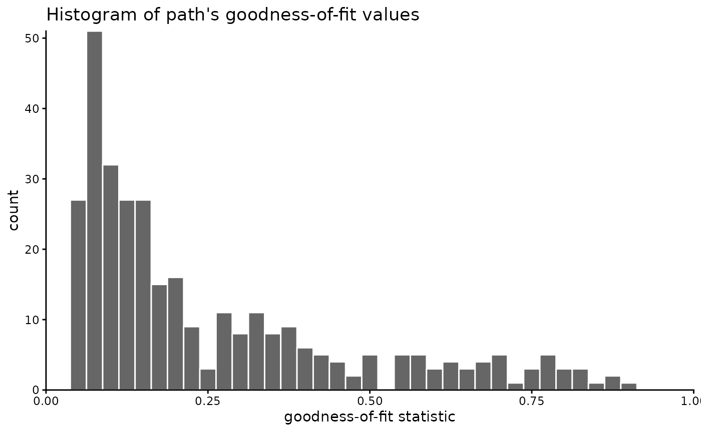
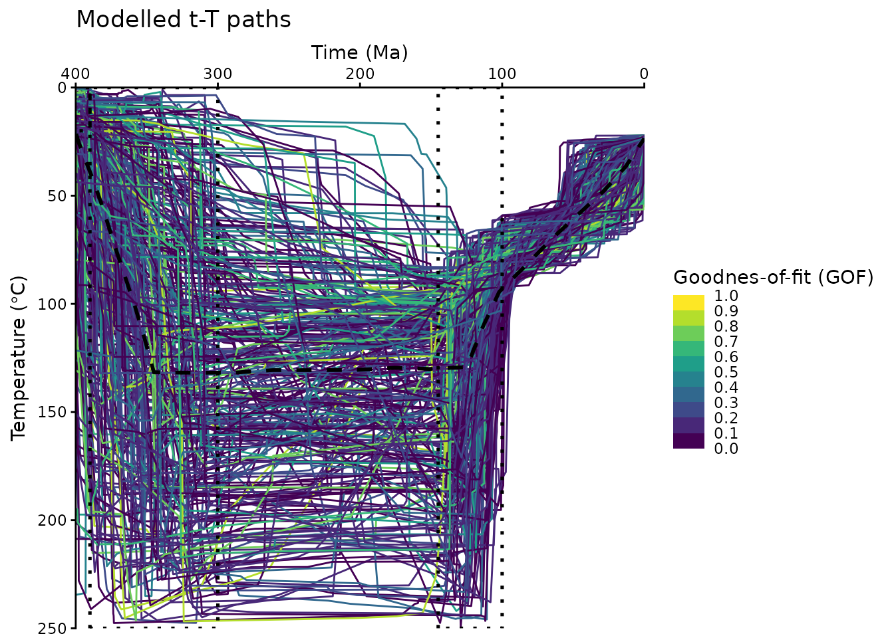
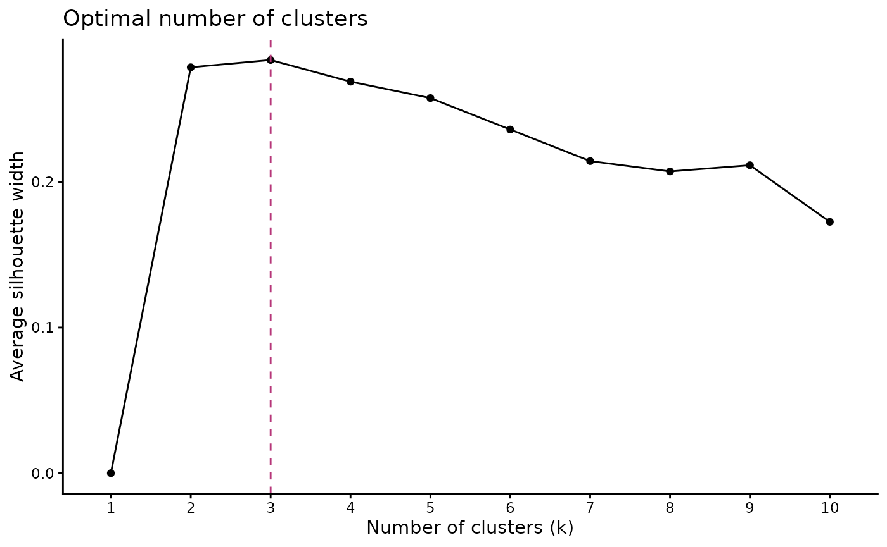
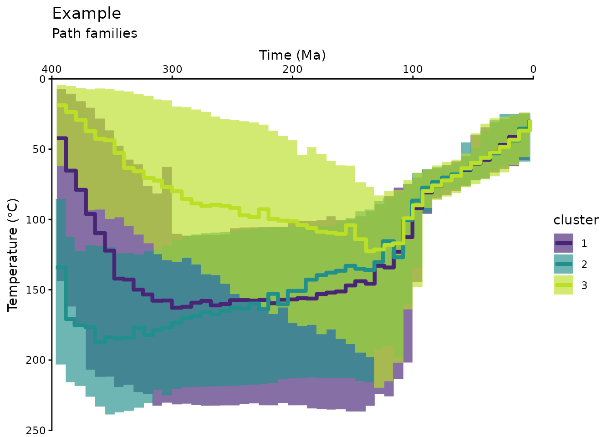
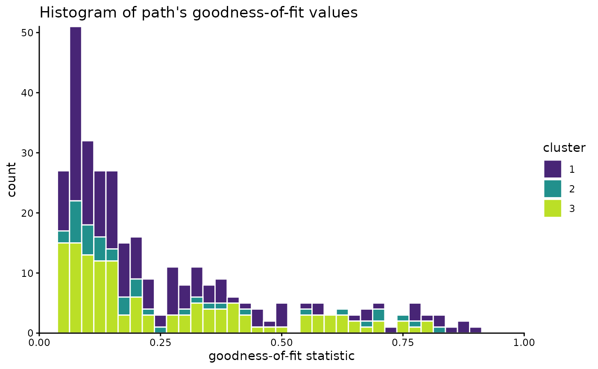
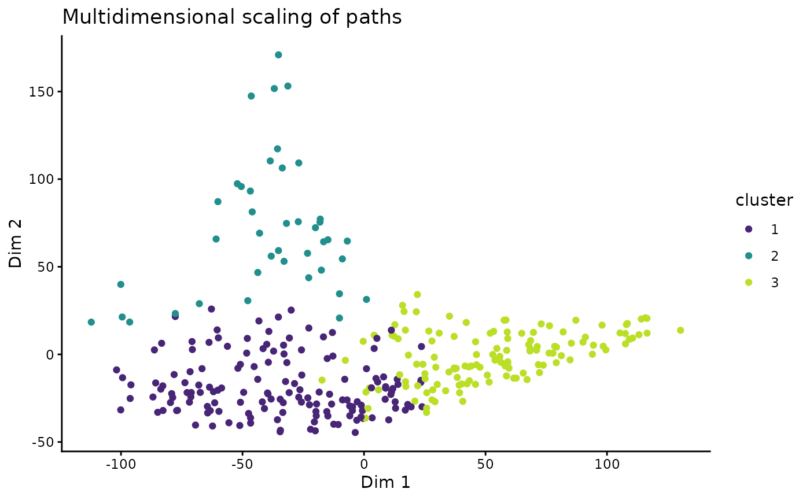
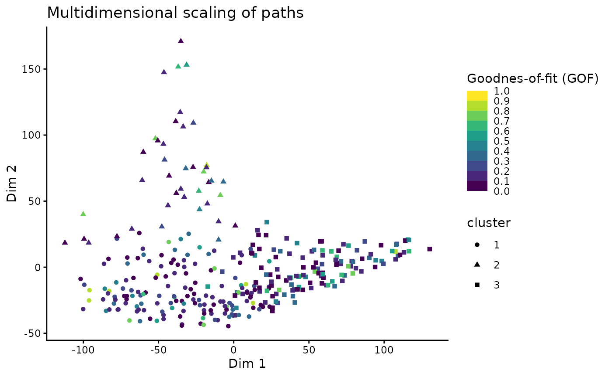
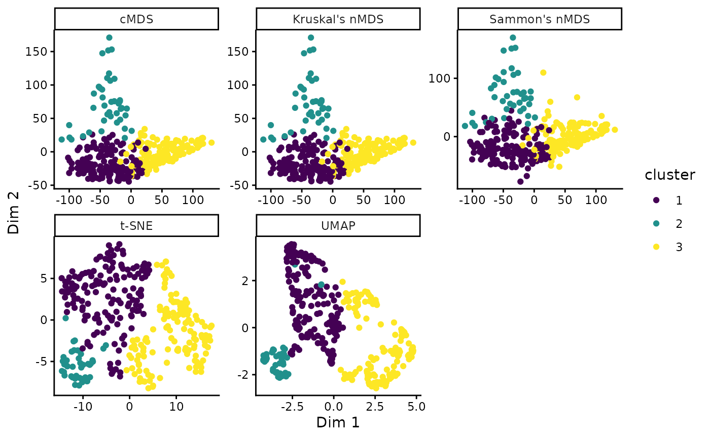

# Path clustering

This document provides a brief working example to demonstrate how to
cluster time-temperature paths from HeFTy inverse thermal history
models.

Load some example data:

``` r
path2myfile <- system.file("112-73_30_H1_50-inv.txt", package = "thermoclustr")
tT_paths <- read_hefty(path2myfile)

# Extract the paths and reorder the paths by the GOF values:
paths <- tT_paths$paths |>
  dplyr::arrange(Fit, Comp_GOF) |>
  dplyr::mutate(segment = forcats::fct_reorder(segment, Comp_GOF))
```

Extract the weighted mean path from the loaded objects, and build a
constrain box from the min/max values given for the constraints (later
used for plotting):

``` r
# Extract mean path:
mean_path <- tT_paths$weighted_mean_path

# Extract the constraints:
constraints <- tT_paths$constraints

# build a constraint box polygon:
constraint_box <- do.call(rbind, lapply(seq_along(constraints), function(i) {
  data.frame(
    x = c(constraints$max_time[i], constraints$max_time[i], constraints$min_time[i], constraints$min_time[i]),
    y = c(constraints$max_temp[i], constraints$min_temp[i], constraints$min_temp[i], constraints$max_temp[i]),
    group = constraints$constraint[i]
  )
}))
```

You can quickly inspect your Hefty output by calling individual list
elements:

``` r
print(tT_paths$summary)
#>                            grain     mean        sd      min       max
#> 1            good AFT Lm (<b5>m) 11.91381 0.3385423 11.17598  12.61495
#> 2              good AFT age (Ma) 97.10919 3.3983183 91.25161 103.43879
#> 3  good 112-73-2a corr. age (Ma) 43.67936 4.2493954 34.68526  52.60130
#> 4  good 112-73-3a corr. age (Ma) 43.13571 4.3059370 33.98576  52.21119
#> 5  good 112-73-4a corr. age (Ma) 36.97330 6.0464201 25.28206  49.20111
#> 6  good 112-73-5a corr. age (Ma) 48.60404 3.8672977 39.50322  57.92818
#> 7             acc AFT Lm (<b5>m) 12.41629 0.5669847 10.71820  13.38772
#> 8               acc AFT age (Ma) 92.63882 7.0138344 82.44131 112.45117
#> 9   acc 112-73-2a corr. age (Ma) 49.17848 8.8319324 27.06320  63.77134
#> 10  acc 112-73-3a corr. age (Ma) 48.56021 8.8235832 26.76311  63.33728
#> 11  acc 112-73-4a corr. age (Ma) 42.07558 9.6831207 18.15850  60.46109
#> 12  acc 112-73-5a corr. age (Ma) 53.85368 8.4278438 29.71129  66.94035
```

To analyze a *subset* of the data, you can filter the data using a time
and temperature range. For example:

``` r
max_time <- 400
max_temperature <- 250

paths_filtered <- crop_paths(
  tT_paths,
  time = c(-Inf, max_time),
  temperature = c(-Inf, max_temperature)
)
```

You may also filter the data by a GOF threshold or range. Maybe first
you may check how the GOF values are distributed:

``` r
# set `theme_classic()` as the default ggplot theme
theme_set(theme_classic())

paths_filtered$paths |>
  dplyr::select(segment, Comp_GOF) |>
  dplyr::distinct() |> 
  ggplot(aes(Comp_GOF)) +
  geom_histogram(
    color = "white", , fill = "grey40",
    binwidth = .025
  ) +
  coord_cartesian(xlim = c(0, 1), expand = FALSE, clip = "off") +
  labs(
    x = "goodness-of-fit statistic", title = "Histogram of path's goodness-of-fit values"
  )
```



In our example, we will **not** filter the GOF values, because we hope
the clustering may identify “hidden” path families that might go
undetected if we filter the data too much. If you still want to filter
the paths, you could do it likes this:

Now we *visualize* the filtered t-T paths:

``` r
ggplot(paths_filtered$paths, aes(time, temperature, group = segment, color = Comp_GOF)) +
  geom_path() +
  labs(
    title = "Modelled t-T paths",
    x = "Time (Ma)",
    y = bquote("Temperature (" * degree * "C)")
  ) +
  geom_path(
    data = mean_path, aes(time, temperature),
    color = "black", linewidth = 1, linetype = "dashed", inherit.aes = FALSE
  ) +
  geom_polygon(
    data = constraint_box, aes(x, y, group = group),
    fill = NA, color = "black", linetype = "dotted", lwd = .9, inherit.aes = FALSE
  ) +
  scale_color_viridis_b(
    "Goodnes-of-fit (GOF)",
    limits = c(0, 1),
    breaks = seq(0, 1, .1),
    oob = squish
  ) +
  scale_x_reverse(position = "top") +
  scale_y_reverse() +
  coord_cartesian(expand = FALSE, ylim = c(max_temperature, 0), xlim = c(max_time, 0))
```



> The above plot uses some minor modifications of a default
> [`ggplot2::ggplot()`](https://ggplot2.tidyverse.org/reference/ggplot.html),
> e.g. reverse the axes and colors etc. Feel free to edit these plots
> following your personal preferences. Check the ggplot user manual for
> more details: <https://ggplot2.tidyverse.org/>

## Clustering

First, we calculate the dissimilarities between the paths using the
**Hausdorff distance**:

``` r
tT_diss <- path_diss(paths_filtered, dist = "Hausdorff")
```

> An alternative measure for the dissimilarities is the Fréchet distance
> using `dist = 'Frechet'`.

### Is the data clustered?

Whether the data is actually clustered can be checked using the Hopkins
statistic (H), i.e. the mean nearest neighbor distance in the random
data set divided by the sum of the mean nearest neighbor distances in
the real and across the simulated data set

How to interpret the Hopkins statistics? If data D were uniformly
distributed, then the distances between the reals and the simulated data
would be close to each other, and thus H would be about 0.5. However, if
clusters are present in D, then the distances for artificial points
would be substantially larger than for the real ones in expectation, and
thus the value of H will increase (Han, Kamber, and Pei 2012).

A value for H higher than 0.75 indicates a clustering tendency at the
90% confidence level.

The null and the alternative hypotheses are defined as follow:

- Null hypothesis: the data set D is uniformly distributed (i.e., no
  meaningful clusters)

- Alternative hypothesis: the data set D is not uniformly distributed
  (i.e., contains meaningful clusters)

> We can conduct the Hopkins Statistic test iteratively, using 0.5 as
> the threshold to reject the alternative hypothesis. That is, if H \<
> 0.5, then it is unlikely that D has statistically significant
> clusters. Put in other words, If the value of Hopkins statistic is
> close to 1, then we can reject the null hypothesis and conclude that
> the dataset D is significantly a clusterable data.

``` r
tT_diss$hopkins
#> statistic   p-value 
#> 0.9898103 0.0000000
```

The result shows that our data is likely clusterable.

### How many clusters?

The **optimal number of clusters** can be estimated using
[`path_nbclust()`](https://tobiste.github.io/thermoclustr/reference/path_nbclust.md)
and is based on the *average silhouette width*:

``` r
path_nbclust(tT_diss)
#> $optimal
#> [1] 3
#> 
#> $plot
```



The method recommends 3 clusters for the t-T paths.

### Cluster the data

Finally we cluster the data using our estimate for the optimal number of
clusters. The clustering is done using
[`cluster_paths()`](https://tobiste.github.io/thermoclustr/reference/cluster_paths.md),
which returns a data.frame containing the path number and its assigned
cluster:

``` r
cluster_res <- paths_filtered |>
  cluster_paths(k = 3, method = "hclust")

# print the first rows of the cluster result:
head(cluster_res)
#>   segment cluster
#> 1       1       1
#> 2      10       2
#> 3     100       1
#> 4     101       2
#> 5     102       1
#> 6     103       1
```

You can quickly check how many paths are assigned to each cluster:

``` r
count_cluster(cluster_res)
#>   1   2   3 
#> 152  41 131
```

In our example, the paths are almost equally distributed in two
clusters.

We can now merge the cluster result with the original path data.frame:

``` r
path_families <- right_join(
  cluster_res, paths_filtered$paths,
  join_by(segment)
)
```

We can calculate also some path statistics (e.g. median paths, 5% and
95% quantiles) for each cluster:

``` r
path_families_binned <- path_families |>
  dplyr::group_by(cluster) |>
  densify_cluster() |>
  path_statistics()

head(path_families_binned)
#> # A tibble: 6 × 13
#>   cluster bins     time_min time_median time_max temp_mean temp_sd temp_IQR
#>   <fct>   <fct>       <dbl>       <dbl>    <dbl>     <dbl>   <dbl>    <dbl>
#> 1 1       (-0.4,8]     0           3.14     8.00      32.1    8.87     11.3
#> 2 1       (8,16]       8.00       11.9     16.0       38.6   10.8      16.4
#> 3 1       (16,24]     16.0        20.0     24.0       42.1   11.3      17.1
#> 4 1       (24,32]     24.0        27.9     32.0       46.4   10.8      15.6
#> 5 1       (32,40]     32.0        36.2     40.0       51.1   10.4      13.2
#> 6 1       (40,48]     40.0        43.8     48.0       56.4   10.2      12.2
#> # ℹ 5 more variables: temp_median <dbl>, temp_max <dbl>, temp_min <dbl>,
#> #   temp_5 <dbl>, temp_95 <dbl>
```

Plot the cluster of the modeled t-T paths:

``` r
ggplot(data = path_families_binned) +
  geom_ribbon(
    aes(x = time_median, ymin = temp_5, ymax = temp_95, group = cluster, fill = cluster),
    stat = "stepribbon",
    inherit.aes = FALSE,
    alpha = .66
  ) +
  geom_step(
    aes(x = time_median, y = temp_median, color = cluster),
    lwd = 1.5
  ) +
  scale_color_viridis_d(aesthetics = c("fill", "color"),
                        begin = .1, end = .9) +

  # Axes settings:
  scale_y_reverse() +
  scale_x_reverse(position = "top") +

  # Labels:
  labs(
    title = "Example",
    subtitle = "Path families",
    x = "Time (Ma)",
    y = bquote("Temperature (" * degree * "C)")
  ) +
  # facet_wrap(vars(cluster)) + # uncomment if you want each cluster in a separate plot
  coord_cartesian(expand = FALSE, ylim = c(max_temperature, 0), xlim = c(max_time, 0)) 
```



Have a final look on the distribution of the paths:

``` r
path_families |>
  dplyr::select(segment, cluster, Comp_GOF) |>
  dplyr::distinct() |> 
  ggplot(aes(Comp_GOF, fill = cluster)) +
  geom_histogram(color = "white", binwidth = .025) +
  scale_color_viridis_d(aesthetics = c("fill", "color"), begin = .1, end = .9) +
  coord_cartesian(xlim = c(0, 1), expand = FALSE, clip = "off") +
  labs(
    x = "goodness-of-fit statistic", title = "Histogram of path's goodness-of-fit values"
  )
```



### Multidimensional Scaling

Another way to look at the path-dissimilarities is by transforming the
Hausdorff distance matrix by multidimensional scaling (MDS). MDS reduces
the dimensions of the original dataset, so that the paths will be
plotted as points. Thereby, the plot “maps” the dissimilarities in a way
so that similar paths plot as close points, and different paths will be
far apart.

The
[`path_diss()`](https://tobiste.github.io/thermoclustr/reference/path_diss.md)
function already calculated the MDS coordinates, which can now be
plotted and colored by the cluster results.

``` r
tT_diss_mds <- as.data.frame(tT_diss$mds) |> 
  bind_cols(cluster_res)

ggplot(tT_diss_mds, aes(V1, V2, color = cluster)) +
  geom_point() +
  scale_color_viridis_d(aesthetics = c("fill", "color"), begin = .1, end = .9) +
  labs(title = "Multidimensional scaling of paths", x = "Dim 1", y = "Dim 2") 
```

 \> Note that MDS is a
dimension-reducing transformation Thus, the 2D representation if only a
modified projection of the true relationship of the data and thus can
depict distortions and overlaps.

This visualization offers to explore correlations between the path
similarities (or clusters) and other properties of the paths, such as
the goodness-of-fit values of the Hefty model:

``` r
# join the mds coordinates with the path properties
dplyr::left_join(
  tT_diss_mds, 
  dplyr::distinct(dplyr::select(paths, segment, Comp_GOF)), 
  dplyr::join_by(segment)
  ) |> 
ggplot(aes(V1, V2, color = Comp_GOF, shape = cluster)) +
  geom_point() +
  scale_color_viridis_b(
    "Goodnes-of-fit (GOF)",
    limits = c(0, 1),
    breaks = seq(0, 1, .1),
    oob = squish
  ) +
  labs(title = "Multidimensional scaling of paths", x = "Dim 1", y = "Dim 2") 
```



By default, *classical metric MDS* is used. Alternatively, other methods
such as *Kruskal’s non-metric MDS*, *Sammon’s non-metric MDS*, *Uniform
Manifold Approximation and Projection* (UMAP), or *t-distributed
Stochastic Neighbor Embedding* (t-SNE) can be used:

``` r
# Classical MDS
tT_cmds <- stats::cmdscale(tT_diss$diss) 
tT_cmds_coords <- data.frame(tT_cmds) |>
  dplyr::bind_cols(cluster_res) |> 
  dplyr::mutate(method = 'cMDS') 

# Kruskal's non-metric MDS (nMDS)
tT_nmds <- MASS::isoMDS(tT_diss$diss)
#> initial  value 24.573803 
#> final  value 24.573021 
#> converged
tT_nmds_coords <- data.frame(tT_nmds$points) |> 
  dplyr::bind_cols(cluster_res) |> 
  dplyr::mutate(method = "Kruskal's nMDS") 

# Sammon's nMDS
tT_sammon <- MASS::sammon(tT_diss$diss)
#> Initial stress        : 0.10203
#> stress after   3 iters: 0.08971
tT_sammon_coords <- data.frame(tT_sammon$points) |> 
  dplyr::bind_cols(cluster_res) |> 
  dplyr::mutate(method = "Sammon's nMDS") 

# t-distributed Stochastic Neighbor Embedding (t-SNE)
tT_tsne <- Rtsne::Rtsne(tT_diss$diss, is_distance = TRUE)
tT_tsne_coords <- data.frame(tT_tsne$Y) |> 
  dplyr::bind_cols(cluster_res) |> 
  dplyr::mutate(method = "t-SNE") 

# Uniform Manifold Approximation and Projection (UMAP)
if(require(RcppHNSW)) library(RcppHNSW)
tT_umap <- uwot::umap2(tT_diss$diss)
tT_umap_coords <- data.frame(tT_umap) |>
  dplyr::bind_cols(cluster_res) |> 
  dplyr::mutate(method = 'UMAP')

# Combine and plot:
dplyr::bind_rows(
  tT_cmds_coords,
  tT_nmds_coords,
  tT_sammon_coords,
  tT_tsne_coords,
  tT_umap_coords
) |> 
  ggplot(aes(X1, X2, color = cluster)) +
  geom_point() +
  facet_wrap(vars(method), scales = 'free') +
  scale_color_viridis_d() +
  labs(x = "Dim 1", y = "Dim 2")
```


