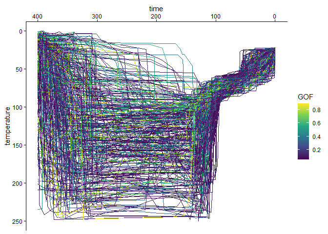
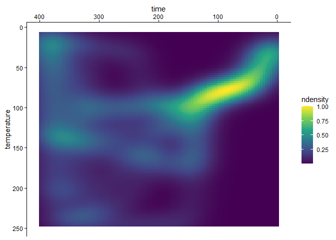
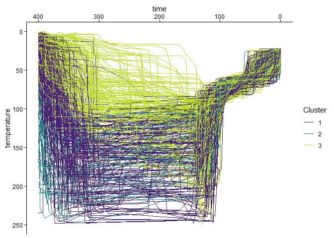

# thermoclustr

The goal of {thermoclustr} is to provide tools to further analyze
thermal history models in thermochronology, including estimating cooling
path densities, and path families.

## Installation

You can install the development version of {thermoclustr} from
[GitHub](https://github.com/) with:

``` r
# install.packages("devtools")
devtools::install_github("tobiste/thermoclustr")
```

## Example

The following minimal example shows how to import data, visualize the
paths and the path density as well as how to filter, and cluster the t-T
paths into 3 path families.

``` r
library(thermoclustr)
library(dplyr)
library(ggplot2)

# load example dataset of a HeFTy model output
path2myfile <- system.file("112-73_30_H1_50-inv.txt", package = "thermoclustr")
tT_paths <- read_hefty(path2myfile)

# set `theme_classic()` as the default ggplot theme
theme_set(theme_classic())
```

The HeFTy model contains the modeled paths, the initial model
constraints, the weighted mean path, and some summary statistics on the
mineral grains. {thermochlustr} imports the model as a `list` that
contains the aforementioned features as list entries.

Thus, to visualize the paths with need to extract the `path` object from
the imported model `tT_paths`:

``` r
# (Optional) Create a subset of interest of the data:
tT_paths_cropped <- crop_paths(tT_paths, time = c(0, 400), temperature = c(0, 250))

tT_paths_cropped$paths |>
  ggplot(aes(time, temperature, color = Comp_GOF, group = segment)) +
  geom_path() +
  scale_color_viridis_c("GOF") +
  scale_x_reverse(position = "top") +
  scale_y_reverse()
```



The path density can be visualized using
[`plot_path_density_filled()`](https://tobiste.github.io/thermoclustr/reference/plt_density.md):

``` r
plot_path_density_filled(tT_paths_cropped, geom = "raster") +
  scale_x_reverse(position = "top") +
  scale_y_reverse() +
  scale_fill_viridis_c()
```



To cluster the data, the following steps are required:

``` r
# Cluster the paths
paths_cluster <- cluster_paths(tT_paths_cropped, k = 3)

# Join with path dataset
paths_clustered <- merge(
  tT_paths_cropped$paths,
  paths_cluster,
  by = "segment"
)
```

Finally, the visualization of the clustered t-T paths:

``` r
paths_clustered |>
  ggplot(
    aes(
      x = time,
      y = temperature,
      color = cluster,
      group = segment
    )
  ) +
  geom_path() +
  scale_x_reverse(position = "top") +
  scale_y_reverse() +
  scale_color_viridis_d("Cluster", begin = .1, end = .9)
```



## Documentation

The detailed documentation can be found at
<https://tobiste.github.io/thermoclustr/>

## Author

Tobias Stephan (<tstephan@lakeheadu.ca>)

## Feedback, issues, and contributions

I welcome feedback, suggestions, issues, and contributions! If you have
found a bug, please file it
[here](https://github.com/tobiste/thermoclustr/issues) with minimal code
to reproduce the issue.

## How to cite thermoclustr

tba

## License

GPL-3.0 License
