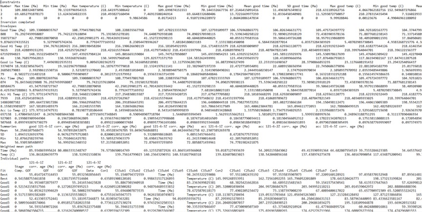

```{r setup, include=FALSE}
knitr::opts_chunk$set(
  collapse = TRUE,
  comment = "#>"
)
library(thermochron)
```

This document provides step-by-step instructions for producing density
plots derived from HeFTy inverse thermal history models as seen in
Padgett et al. (accepted) and Johns-Buss et al. (submitted). Part I
explains how to export data from HeFTy and import it into R. Part II
explains how to run the R code to produce the density plots. This
tutorial assumes you have R and RStudio downloaded and installed.

## Part I

### Export your HeFTy model paths

1.  Open a thermal history model file (.hft or .hfm) in HeFTy. Once
    open, click on the “Inverse Modeling” button in the top left. Make
    sure your inverse modeling results are visible in your
    time-temperature window. Right-click inside the time-temperature
    window (for example, the location of the “X” in Figure 1). 

2.  Scroll down to “Export”. Click “Save as Text”. Save the .txt file.
    The text file should look similar to Figure 2.



### Load Input Data

Open R and install and load the necessary packages. You can install the
packages by running the following code:

```{r packages1, eval=FALSE, include=TRUE}
install.packages("scico")
library(scico)

install.packages("ggplot2")
library(ggplot2)
```

```{r packages2, include=FALSE,eval=TRUE}
library(ggplot2)
```

Next, install the {thermochron} package by running the following code:

```{r packages3, eval=FALSE, include=TRUE}
remotes::install_github("tobiste/thermochron")
library(thermochron)
```

Define the path to your .txt file. For example:

```{r fname}
path2myfile <- 'inst/112-9-30-zr-inv.txt'
```

> Be aware that R uses forward-slashes (/) to separate folders.


Next, you import the .txt file into R by using the function
`read_hefty()`:

```{r data}
tT_paths <- read_hefty(path2myfile)$paths
```

## Part II

### Plot the path density

To plot the density of the paths, you simply use the function
`plot_path_density()`:

```{r seed1, include=FALSE}
set.seed(123)
```

```{r plot1, out.width="100%"}
plot1 <- plot_path_density_filled(tT_paths, show.legend = FALSE)
print(plot1)
```

This uses the package's default values for smoothing and binning and
creates a `ggplot` type graphic.

You can customize the smoothing and density binning by changing the
parameters - `bins` - the number of filled contours.

-   `GOF_rank` - Selects only the n highest GOF ranked paths.

-   `densify` - Should extra points be added along the individual paths
    to avoid that only the vertices of the path are evaluated?

-   `n` - How many equally-spaced extra points should be added along
    between the vertices of the path (if `densify=TRUE`).

-   `samples` - Size of a random subsample of all the paths to reduce
    the computation time.

```{r seed2, include=FALSE}
set.seed(123)
```

```{r plot2, out.width="100%"}
plot2 <- plot_path_density_filled(tT_paths, bins = 25, GOF_rank = 5, densify = TRUE, n = 100, max_distance = 1, samples = 100, show.legend = FALSE)
print(plot2)
```

Finally, you can customize your ggplot, such as axes labels, change
colors, and reverse the axes:

```{r plot3, out.width="100%"}
plot2 +
  labs(
    title = "Kernel density of t-T paths",
    caption = "data from Fontes Pinto et al. (in prep.)",
    x = "Time (Ma)",
    y = bquote("Temperature (" * degree * "C)")
  ) +
  theme_classic() +
  coord_cartesian(expand = FALSE) +
  scale_x_continuous(transform = "reverse", position = "top") +
  scale_y_continuous(transform = "reverse") +
  guides(fill = "none")
```
